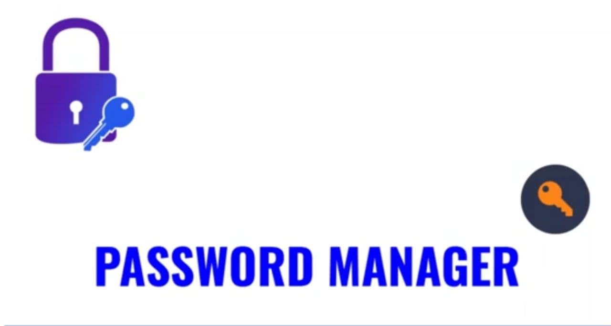

  
 

 <h2> <i> In the real world, the only threat to us is posed by the criminals residing in our area but in the digital world, one would be prone to threat by any person who resides millions of kilometres away. We are living in a digital world where our lives, finances and biodata, everything is digitized through electronic media and internet making us more vulnerable than ever before to cyber attacks. Most of the people that are frequently prone to cyber attacks are the ones who aren't aware of the importance of having a strong password. </h2>

 

# Applications and Scenarios

### Most of the users who claim that they have been robbed were found that they created passwords that just happen to have alphabets which commonly turnout to be their names,dictionary words, mobile number, or digits entered sequentially, less characters (less than 8) etc. Every year, millions of dollars were being washed away towards the hackers due to people's negligence toward security.
### In our application,we help the user in creating a password that isn't complicated enough to remember and at the same time, good enough making it impossible for the hacker to crack.

 

## Tech Stack  
### 1.Python  
### 2.PyQT5  
### 3.DBMS  

   

 
 

# Screenshots
## Input Screen
   
## Output Screen-
   

### Give It a Star if you liked the project 
